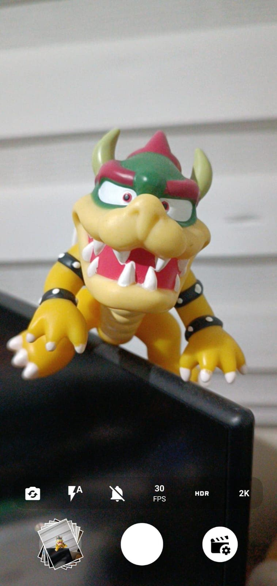

# Vision Camera App

## **Overview**

This is a React Native app that uses the Vision Camera plugin to capture photos. The app allows users to take photos using the camera and view the captured images.

## **Image**

## **Features**

### Functionality

- Capture photos using the Vision Camera plugin
- Miniature view of captured images
- Camera settings:
  - Front/Back camera
  - Flash
  - Sound indicator
  - FPS
  - **HDR**
  - **Image quality**
- **Improved design**

## **Getting Started**

### Prerequisites

- Xcode installed on your Mac
- Node.js and npm installed on your system

### Installation

1. Clone the repository from GitHub: `git clone https://github.com/malejogs/VisionCameraApp.git`
2. Install dependencies: `npm install`

### Running the App

---

**Important:** This app requires a physical device with a camera to run. You cannot run it on an emulator.

1. Connect an iPhone or iPad to your Mac
2. Run the app using the command: `npm run ios:device`
3. Select your device
4. Open the app in your device
5. Tap the camera button to start capturing photos
6. Tap the right button to show/hide the camera settings (e.g. flash, HDR, etc.)
7. Take a photo by tapping the camera button again
8. Tap the miniatures and view the captured images in the app

## **Author**

- Manuel Alejandro Gonzalez Suarez
- Email: [alejandro-gonzalez20@hotmail.com](mailto:alejandro-gonzalez20@hotmail.com)
